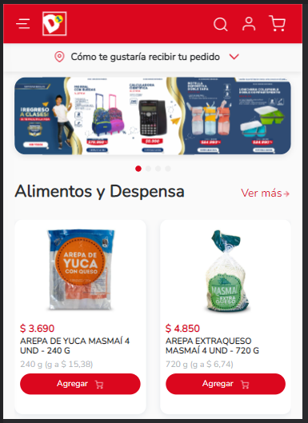
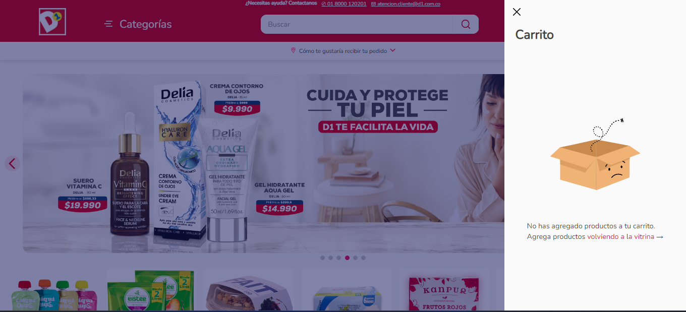
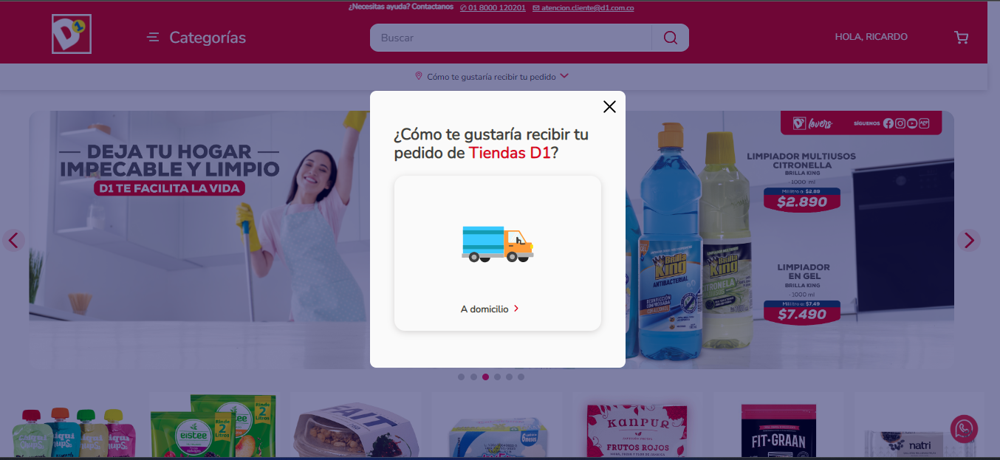

<center> <h1>store-theme Tiendas D1</h1> </center>

## Objetivo del proyecto

Crear una eCommerce similar a [Tiendas D1](https://domicilios.tiendasd1.com/). 

## Tecnologia utilizada

- VTEX IO.
- React

<center> <h2>Vistas del proyecto</h2> </center>

## HEADER
```bash
Desktop y Tablet
```

-  VTEX

<p>
  
</p>

-  D1

<p>
  
</p>


- Phone

<p align="center" >
  
  
</p>


- Mega menu  <br> Este es el mega menu de desktop y tablet, en phone ocupa todo el ancho de la pantalla <br/>
  

<p align="center" >
  
</p>

- Carrito <br> Este es el carrito de desktop y tablet, en phone ocupa todo el ancho de la pantalla <br/>

<p align="center" >
  
</p>

- Modal de 'Como te gustaría recibir tu pedido' <br> Este es el modal de desktop y tablet, en phone ocupa todo el ancho y largo de la pantalla <br/>

<p align="center" >
  
</p>

## HOME
-  Slider

<p align="center" >
  
</p>


## Configuration

### Paso 1 - Configuración básica  
Ingrese a la [guía básica de configuración](https://developers.vtex.com/vtex-developer-docs/docs/vtex-io-documentation-2-basicsetuptodevelopinvtexio) de VTEX IO y siga los pasos.  
Al final de la configuración, debería tener instalada la interfaz de línea de comandos de VTEX (Toolbelt) junto con un workspace para desarrolladores en el que pueda trabajar.

### Paso 2 - Clonación del repositorio Minimum Boilerplate.

Use este repositorio como [plantilla](https://github.com/vtex-apps/minimum-boilerplate-theme) para crear un repositorio de forma local para poder comenzar a trabajar de manera efectiva en él

Luego, acceda al directorio del repositorio usando su terminal.

### Paso 3 - Editando el archivo Manifest.json
Una vez en el directorio del repositorio, es hora de editar el archivo manifest.json.

Una vez estemos en el archivo, deberá remplazar los valores de vendor y name. vendor es el nombre de la cuenta en la que estamos trabajando y account es lo que desee colocar de nombre para su tema. Opcionalmente puede modificar la versión  

Por ejemplo:  
{
  "vendor": "itgloberspartnercl",
  "name": "store-theme",
  "version": "0.0.1"
}

### Paso 4 - Instalando las apps requeridas
Para usar Store Framework y trabajar en el tema de su tienda, es necesario tener `vtex.store-sitemap` y `vtex.store` instalados.

Ejecute `vtex list` y compruebe si esas aplicaciones ya están instaladas.

Si no es así, ejecute el siguiente comando para instalarlos: `vtex install vtex.store-sitemap vtex.store -f`

### Paso 5 - Desinstalar cualquier tema existente
Al correr `vtex list`, puede verificar si hay algún tema instalado.

Es común tener ya instalado un vtex.store-theme cuando inicia el proceso de desarrollo front de la tienda.

Por lo tanto, si lo encuentra en la lista de la aplicación, copie su nombre y utilícelo junto con el comando `vtex uninstall`. Por ejemplo:

```json
vtex uninstall vtex.store-theme
```
### Paso 6 - Ejecute y obtenga una vista previa de su tienda
Entonces ha llegado el momento de cargar todos los cambios que realizó en sus archivos locales a la plataforma. Para eso, use el comando `vtex link`.

Si el proceso se ejecuta sin errores, se mostrará el siguiente mensaje: `App linked successfully`. Luego, ejecute el comando vtex browse para abrir una ventana del navegador con su tienda vinculada.

Esto le permitirá ver los cambios aplicados en tiempo real, a través de la cuenta y el espacio de trabajo en el que está trabajando.


```json
"dependencies": {
    "vtex.store": "2.x",
    "vtex.store-header": "2.x",
    "vtex.product-summary": "2.x",
    "vtex.store-footer": "2.x",
    "vtex.store-components": "3.x",
    "vtex.styleguide": "9.x",
    "vtex.slider": "0.x",
    "vtex.carousel": "2.x",
    "vtex.shelf": "1.x",
    "vtex.menu": "2.x",
    "vtex.minicart": "2.x",
    "vtex.product-details": "1.x",
    "vtex.product-kit": "1.x",
    "vtex.search-result": "3.x",
    "vtex.login": "2.x",
    "vtex.my-account": "1.x",
    "vtex.flex-layout": "0.x",
    "vtex.rich-text": "0.x",
    "vtex.store-drawer": "0.x",
    "vtex.locale-switcher": "0.x",
    "vtex.product-quantity": "1.x",
    "vtex.product-identifier": "0.x",
    "vtex.product-specification-badges": "0.x",
    "vtex.product-review-interfaces": "1.x",
    "vtex.telemarketing": "2.x",
    "vtex.order-placed": "2.x",
    "vtex.stack-layout": "0.x",
    "vtex.tab-layout": "0.x",
    "vtex.responsive-layout": "0.x",
    "vtex.slider-layout": "0.x",
    "vtex.iframe": "0.x",
    "vtex.breadcrumb": "1.x",
    "vtex.sticky-layout": "0.x",
    "vtex.add-to-cart-button": "0.x",
    "vtex.store-image": "0.x",
    "vtex.modal-layout": "0.x",
    "vtex.store-link": "0.x",
    "vtex.store-icons": "0.x",
    "vtex.product-list": "0.x",
    "vtex.checkout-summary": "0.x",
    "vtex.category-menu": "2.x",
    "vtex.disclosure-layout": "1.x",
    "vtex.product-price": "1.x",
    "vtex.store-form": "0.x",
    "vtex.store-newsletter": "1.x",
    "vtex.overlay-layout": "0.x",
    "vtex.product-context": "0.x",
    "vtex.product-highlights": "2.x",
    "vtex.product-specifications": "1.x",
    "itgloberspartnercl.whatsapp-button": "0.x",
    "itgloberspartnercl.bullets-diagramation": "0.x"
  },
  "peerDependencies": {
    "vtex.mega-menu": "2.x",
    "vtex.questions-and-answers": "0.x"
  }
```


## Contributors  
1.	Ricardo David Ocampo


